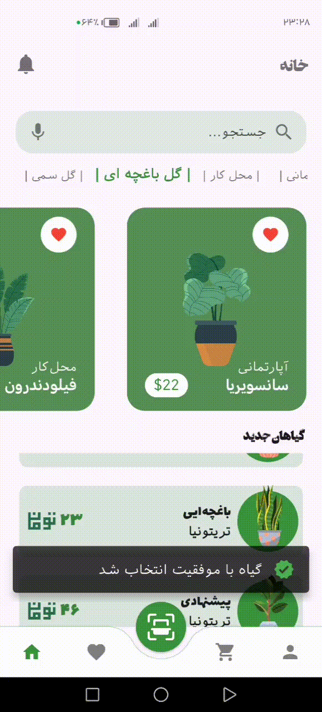

# 🌸 Flutter Flower Shop

 

---

A clean and minimal **flower shopping app** built with **Flutter**, focused on UI/UX design and smooth user experience.

---

## ✨ Key Features

- 🌼 Browse a list of flowers with beautiful cards
- 🛒 Add to cart functionality with dynamic UI
- 💫 Smooth **Hero animations** between pages
- 🧩 Modular widget-based architecture

---

## 🧠 Why This Project?

This app was built as a UI/UX-focused showcase to:

- Practice **Hero animations** and screen transitions
- Build a clean shopping experience without backend
- Structure a scalable Flutter project with custom widgets
- Polish layouting, theming, and responsive design

---

## 🛠 Technologies

- Flutter
- Dart
- Google Fonts
- Hero Animation
- Stateless & Stateful Widgets

---

## 👤 Author

Made with ❤️ by [hossein abddolahi]  
---
